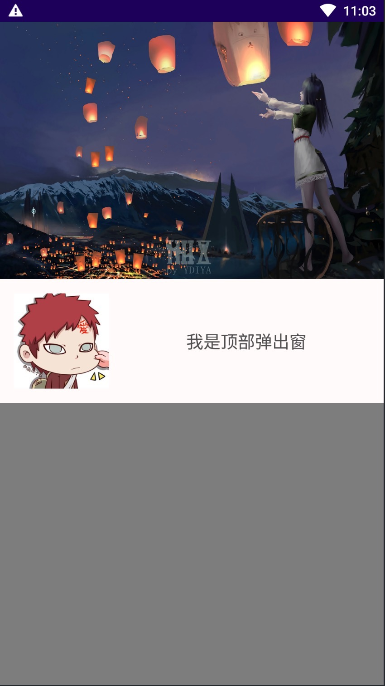
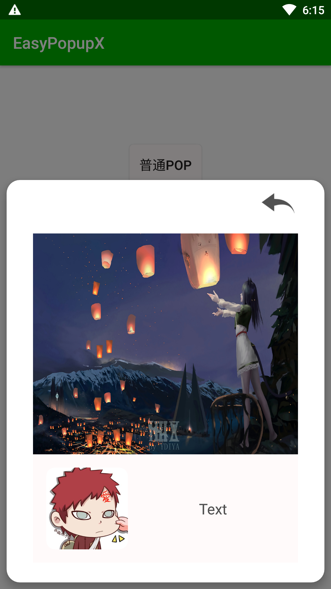
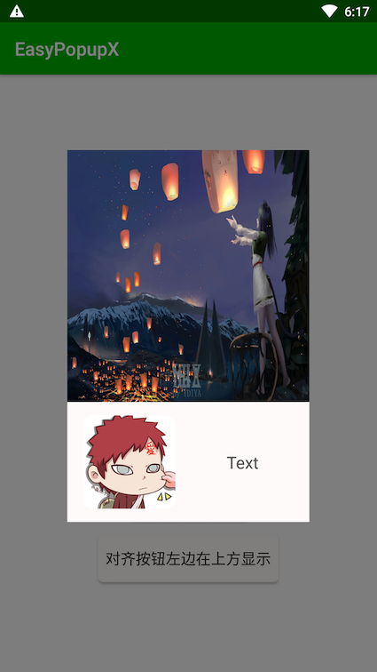
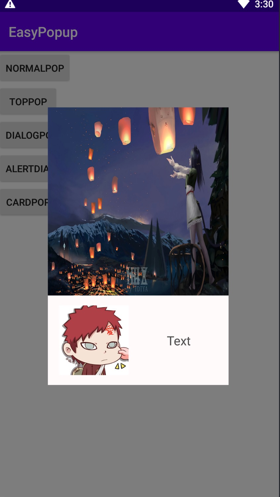

[](https://jitpack.io/#dengzhenli/EasyPopupX)

---
# 关于EasyPopupX

EasyPopupX是一个可以让你在项目里面轻松使用PopupWindow的工具。
你只需按正常的使用习惯即可，其他的事情都交给EasyPopupX

你可以通过EasyPopupX轻松实现例如以下的页面
<div>    
    
    
    
</div>

目前EasyPopupX能带给你的明显变化
* 只需极少的代码
* PopupWindow相关的安全性，兼容性，内存优化都交给EasyPopupX去考虑
* 可以在布局文件里面配置PopupWindow位置了
* 可以在PopupWindow里面直接使用findViewById，也支持synthetic，即kotlin中直接使用id访问组件
* 其他更多属性

---
# 快速接入
（项目目前仅支持AndroidX，我也纠结要不要兼容support，但看到郭霖大佬等人都放弃兼容support，就不给维护加大负担了。若有读者需要这方面需求，可提issue）

## 添加依赖
根项目build.gradle添加jitpack
```
allprojects {
    repositories {
        .....
        maven { url "https://jitpack.io" }
    }
}
```
添加依赖
```
dependencies {
     implementation 'com.github.dengzhenli:EasyPopupX:1.0.2'
}
```
## 定制你的PopupWindow
```kotlin
class TestPop(activity: Activity) : EasyPop(activity) {
    // 这里进行初始化视图操作
    override fun initView(view: View?) { pop_example_text.text = "我是普通弹出窗" }
    // 这里进行初始化数据操作
    override fun initData() {}
    // 这里输入你自己编写的布局文件
    override fun getLayoutId(): Int { return R.layout.pop_test }
    // 点击外部弹窗是否消失
    override fun outClickable(): Boolean { return true }
}
```

你也可以使用java接入，为节省篇幅，后面的演示只用kotlin，java的使用可参考demo
```java
public class TestPop extends EasyPop {
    public TestPop(Activity activity) {  super(activity); }
    @Override
    public void initView(View view) {
        TextView textView = findViewById(R.id.pop_example_text);
        textView.setText("我是普通弹出窗");
    }
    @Override
    public void initData() {}
    @Override
    public int getLayoutId() { return R.layout.pop_test;  }

    @Override
    public boolean outClickable() { return true;  }
}

```

pop_test.xml
```XML
<?xml version="1.0" encoding="utf-8"?>

<androidx.constraintlayout.widget.ConstraintLayout xmlns:android="http://schemas.android.com/apk/res/android"
    xmlns:app="http://schemas.android.com/apk/res-auto"
    android:layout_width="match_parent"
    android:layout_height="400dp"
    android:layout_marginTop="20dp"
    android:layout_gravity="top">

    <include layout="@layout/pop_example"/>

</androidx.constraintlayout.widget.ConstraintLayout>
```
## 调用

### 必须：在需要调用时候创建EasyPop  
```kotlin
    fun normalPop(view: View) {
        TestPop(this).show()
    }
```

### 建议：activity实现 LifecycleOwner 接口，并在调用easypop之前调用register方法  
此方法会进行生命周期注册等步骤。
```kotlin
class MainActivity : AppCompatActivity(), LifecycleOwner {

    override fun onCreate(savedInstanceState: Bundle?) {
        super.onCreate(savedInstanceState)
        setContentView(R.layout.activity_main)
        EasyPopManager.register(this, this)
    }
}

```
若没有进行此步骤，EasyPop需要生命周期时候需要手动调用

### 建议：在onWindowFocusChanged方法调用EasyPopManager.onWindowFocusChanged  
```kotlin
    override fun onWindowFocusChanged(hasFocus: Boolean) {
        super.onWindowFocusChanged(hasFocus)
        EasyPopManager.onWindowFocusChanged(this, hasFocus)
    }
```


### 不重要：你也可以直接声明匿名内部类
```kotlin
    fun normalPop(view: View) {
        object : EasyPop(this@MainActivity) {
            override fun outClickable(): Boolean {
                return true
            }

            override fun initData() {}
            override fun initView(view: View?) {
                pop_example_text.text = "我是普通弹出窗"
            }

            override fun getLayoutId(): Int {
                return R.layout.pop_test
            }

        }.show()
    }
```


---
# 属性


## EasyPop属性

调用示例
```kotlin
val easyPop = TestPop(this);
easyPop.gravity = Gravity.RIGHT
easyPop.show()
```

属性名|属性描述|单位
---|---|---
popupWidth|弹窗的宽度|px
popupHeight|弹窗的高度|px
viewWidth| 弹窗内view的宽度|px
viewHeight| 弹窗内view的高度|px
gravity| 弹窗方向，使用android.view.Gravity的值|int
marginWidth| 弹窗方向基础上距离水平距离|px
marginHeight| 弹窗方向基础上距离垂直距离|px
bgAlpha| 弹窗背景透明度 0-1 |float
isShow| 弹窗是否显示状态|boolean


## XML属性

用于自己定制layout的配置能透传到easypop，例如如下的android:layout_height，不使用easypop的话是不会生效的，
但我觉得这种样式与布局的配置就应该在xml里面设置。easypop已对基本的配置都进行兼容，你只要按照正常的习惯配置即可。
```xml
<?xml version="1.0" encoding="utf-8"?>

<LinearLayout
    xmlns:android="http://schemas.android.com/apk/res/android"
    android:layout_width="match_parent"
    android:layout_height="400dp" 
    >
    <include layout="@layout/pop_example"/>

</LinearLayout>
```
这里的设置本质上是修改easypop的属性，若被影响属性在代码里面手动设置过，则使用手动设置的属性  

属性名|影响属性|备注
---|---|---
"layout_width" |viewWidth popupWidth |
"layout_height" | viewHeight popupHeight |
"layout_gravity"| gravity |
"layout_marginLeft"|   marginWidth |
"layout_marginRight"|   marginWidth |优先于layout_marginLeft
"layout_marginHorizontal"|   marginWidth |优先于layout_marginRight
"layout_marginStart"|  marginWidth |优先于layout_marginHorizontal
"layout_marginEnd"|  marginWidth |优先于layout_marginEnd
"layout_marginBottom"| marginHeigh|
"layout_marginTop"|   marginHeight 优先于layout_marginBottom
"layout_marginVertical"| marginHeight |优先于layout_marginTop
"layout_margin" |  marginWidth     marginHeight |优先于layout_marginVertical，layout_marginHorizontal
  
## 可用方法

方法|描叙
---|---
getLayoutId(): Int|抽象方法，必须实现，设置布局ID
initView(view: View?)|抽象方法，必须实现，编写页面逻辑
initData(）|抽象方法，必须实现，初始化数据
outClickable(): Boolean|点击外部弹窗是否消失    
show(): EasyPop|显示弹窗
finish()|关闭弹窗
dismiss()|隐藏弹窗 
setWidth(width: Int) |设置弹窗宽度，影响viewWidth popupWidth
setHeight(height: Int) |设置弹窗高度 viewHeight popupHeight
onWindowFocusChanged(hasWindowFocus: Boolean)|activity回调方法

### 回调方法
方法|描叙
 ---|---
onReShowPop()|  pop重新加载时调用
onCreatePop() | pop初次加载时调用
onPopDismiss()| pop隐藏时调用
 
 
### 生命周期
easypop通过lifecycle监听Activity的生命周期，因为弹窗调用时候基本activity已经加载完毕，故不监听onCreate和onStart方法  

方法|描叙
---|---
 onDestroy()|Activity生命周期
 onResume()|Activity生命周期
 onPause()|Activity生命周期
 onStop()|Activity生命周期
 

---
# 组件


## 卡片式弹出窗

### CardPopup 卡片式弹出窗
使用：创建一个继承于CardPopup的弹窗，其中getContentLayoutId指定你的布局
```kotlin
class CardTestPop : CardPopup {
    constructor(activity: Activity) : super(activity) {}

    override fun outClickable(): Boolean { return true   }

    override fun getContentLayoutId(): Int {
        return R.layout.card_pop_test
    }
}
```

```kotlin
fun cardPop(view: View) {
    CardTestPop(this).show()
}
```
```xml
<LinearLayout xmlns:android="http://schemas.android.com/apk/res/android"
    android:layout_width="match_parent"
    android:layout_height="wrap_content">

    <include layout="@layout/pop_example"/>
</LinearLayout>

```


CardPopup有两个构造方法  
* constructor(activity: Activity, gravity: Int, width: Int, height: Int)  

        gravity：弹窗方向   
        
        width：弹窗宽度   
        
        height：弹窗高度   

* constructor(activity: Activity)  

        默认gravity为Gravity.BOTTOM   
        
        默认width为MATCH_PARENT   
        
        默认height为WRAP_CONTENT   


## dialog

### DialogPop 通用dialog
示例：
```kotlin
class DialogTest : DialogPop {
    constructor(activity: Activity) : super(activity) {}

    constructor(activity: Activity, gravity: Int, width: Int, height: Int) : super(
        activity,
        gravity,
        width,
        height
    ) {
    }

    override fun getContentLayoutId(): Int {
        return R.layout.pop_test
    }

    override fun outClickable(): Boolean {
        return true
    }

    // 是否使用DialogPop自带背景，选择否，则使用透明背景
    override fun useBackGround(): Boolean {
        return false
    }

}
```

```kotlin
        DialogTest(this, Gravity.CENTER,
            ScreenUtil.dip2px(this,300F),
            ScreenUtil.dip2px(this,400F))
            .show()
```


DialogPop有两个构造方法  
* constructor(activity: Activity, gravity: Int, width: Int, height: Int)  

        gravity：弹窗方向   
        
        width：弹窗宽度   
        
        height：弹窗高度   

* constructor(activity: Activity)  

        默认gravity为Gravity.BOTTOM   
        
        默认width为MATCH_PARENT   
        
        默认height为WRAP_CONTENT   

### AlertDialogPop 标准dialog
AlertDialogPop的用法可参考安卓AlertDialog  
```kotlin

    fun alertDialogPop(view: View) {
        AlertDialogPop.Builder(this)
            .setTitle("标题")
            .setMessage("是否进行下一步操作")
            .setMeasureButton(true, null, View.OnClickListener { finish() })
            .setCancelButton(true, null, null)
            .show()
    }
```

## 其他组件
* BottomPop 底部弹出窗
* LeftPop 左侧弹出窗
* RightPop 右侧弹出窗
* TopPop 顶部弹出窗


## License

```text
Copyright 2018 Huang JinQun

Licensed under the Apache License, Version 2.0 (the "License");
you may not use this file except in compliance with the License.
You may obtain a copy of the License at

   http://www.apache.org/licenses/LICENSE-2.0

Unless required by applicable law or agreed to in writing, software
distributed under the License is distributed on an "AS IS" BASIS,
WITHOUT WARRANTIES OR CONDITIONS OF ANY KIND, either express or implied.
See the License for the specific language governing permissions and
limitations under the License.
```
